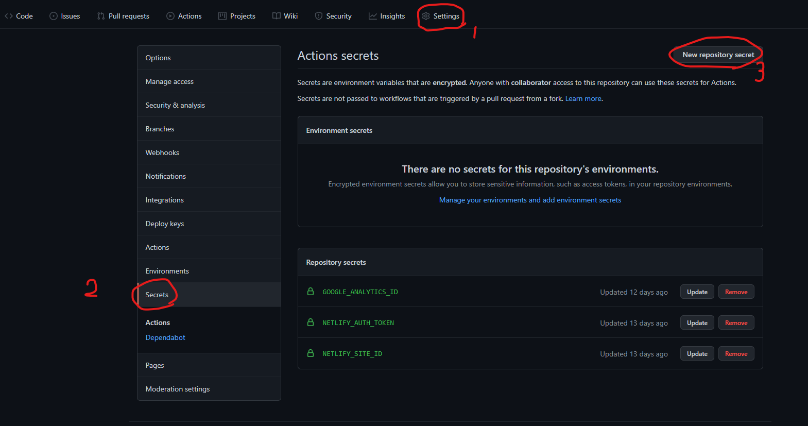
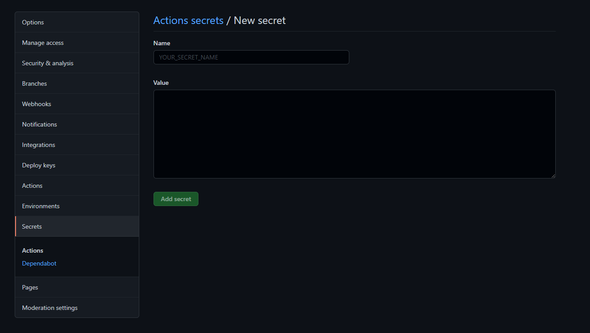

## はじめに
googleanalysisをブログに導入する際に、gatsby-configにそのままtrackingIdを書きたくなかったので、githubactionの環境変数を用いて書きました。
参考になるものはいくつかあったのですが、細かく説明しているものが少なかったので、手順を紹介します。

## 事前準備
### 想定環境
github acitonを使用したビルド環境。


### gatsby-plugin-google-gtaのinstall
[gatsby-plugin-google-gtag](https://www.gatsbyjs.com/plugins/gatsby-plugin-google-gtag/)はgoogle analyticsやgoogleadsenceをgatsbyで使用する際に使用するpluginです。
(googleでgtagが提供される前は`gatsby-plugin-google-analytics`が使用されていました。)
まずは、`gatsby-plugin-google-gta`をinstallします。
```shell:title=shell
npm install gatsby-plugin-google-gtag
```

## 設定
### 設定項目
次にgatby-configの編集を行う前に、今回のビルド環境について、説明します。
私の環境では、github acionでビルドを行ってから、Netlifyへデプロイしています。
デプロイ方法などは他の記事に記載しているので、気になった方は読んでいただけるとうれしいです。
そのため環境変数を用いてビルドする際には、githubへ環境変数を設定し、ビルド時にgithub上の環境変数を読み込みtrackingIDを参照します。
(Netlifyでビルドまで行う場合は、この限りではないので他の記事を参考にしてください。)

設定事項としては下記の3つが必要です。
- gatby-config.js
  - dotenvの導入
  - gatsby-plugin-google-gtagの導入
- build.yml
  - 環境変数の読み込み
- github
  - 環境変数の設定
順番に設定していきます。

### gatby-configの変更
localであれ、CICD環境であれ、環境変数を使用する場合、下記コードを記載する必要があります。
```javascript:title=gatby-config.js
require("dotenv").config({
  path: `.env.${process.env.NODE_ENV}`,
})
```
localで環境変数を設定する場合`.env.development`内に環境変数を記載しますが、今回はgithub上に環境変数を設定するので不要です。
そのためgatby-configは下記のように記載します。

```javascript:title=gatsby-config.js
require('dotenv').config({
  path: `.env.${process.env.NODE_ENV}`,
});

module.exports = {
  plugins: [
    {
      resolve: `gatsby-plugin-google-gtag`,
      options: {
        trackingIds: [
          `${process.env.GOOGLE_ANALYTICS_ID}`,
           ],
        pluginConfig: {
          head: true,
        },
      },
    },
  ],
}
```
ここで、trackingIds内の`${process.env.GOOGLE_ANALYTICS_ID}`は環境変数GOOGLE_ANALYTICS_IDの値が入ります。

### build.yml
github actionのビルド時に使用するbuild.ymlファイルを記載します。
コマンドは他の方の内容を参考にしながら書いたので割愛しますが、npm run buildでビルドする際に環境変数GOOGLE_ANALYTICS_IDへgithubに設定しておいた値を代入しておきます。
```yaml:title=build.yml
name: Build Gatsby and deploy to Netlify

on:
  push:
    branches:
      - master

jobs:
  build:
    runs-on: ubuntu-latest
    steps:
      - uses: actions/checkout@v2
      - uses: actions/setup-node@v2
        with:
          node-version: '12.x'
      - run: npm ci
      - run: npm run build
        env:
          GOOGLE_ANALYTICS_ID: ${{ secrets.GOOGLE_ANALYTICS_ID }}
      - uses: netlify/actions/cli@master
        env:
          NETLIFY_AUTH_TOKEN: ${{ secrets.NETLIFY_AUTH_TOKEN }}
          NETLIFY_SITE_ID: ${{ secrets.NETLIFY_SITE_ID }}
        with:
          args: deploy --dir=public --prod
          secrets: '["NETLIFY_AUTH_TOKEN", "NETLIFY_SITE_ID"]'

```

### githubへ環境変数の設定
githubのsettings >Secrets >New repository secretを選択します。

Nameに環境変数名、Valueにgoogleanalyticsの測定id(Gから始まるid)を記載します。


- googleanalyticsの測定id
  - 歯車マーク> プロパティのデータストリーム> 設定しているドメイン> ウェブストリームの詳細の右上


## 確認
設定が終わったら、googleanalyticsのリアルタイムに自分のアクセスが反映されていれば完了

## おわりに
gatsbyでgoogleanalyticsのtracking idを秘匿化し設定することができました。
色々な記事を参考にしながら実装し、うまくいかないことがあったので、参考にしてくれたらうれしいです。