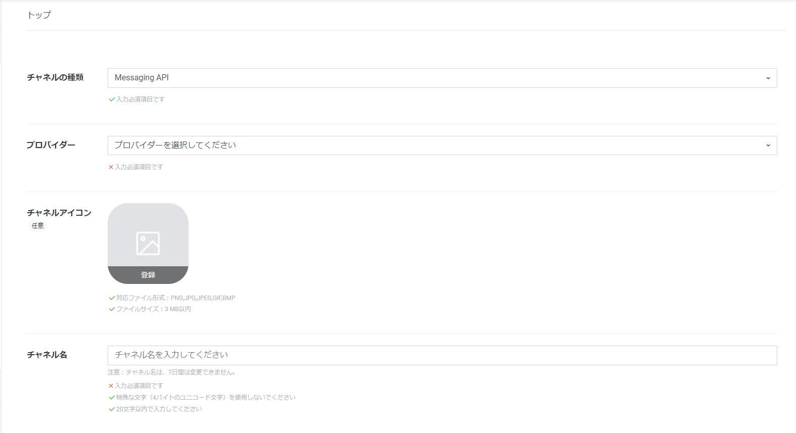
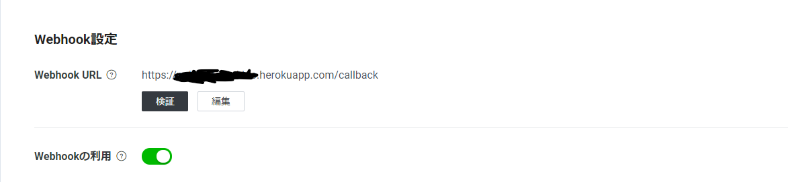
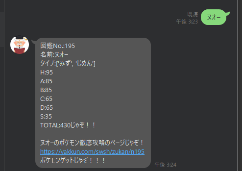

## はじめに
ポケモンをプレイするにあたって、それぞれのポケモンのステータスや育成方法をわざわざ調べるのめちゃ大変だと思います。
そこで、今回botの勉強もかねて、ポケモンの情報を垂れ流すオーキド博士botを作ってみました。

## ポケモンのデータの準備
### ポケモンのステータスデータ
今回使用したポケモンのデータデータは[こちら](https://github.com/fanzeyi/pokemon.json)です。

https://github.com/fanzeyi/pokemon.json

こちらのデータには、ポケモンのデータの他に、ポケモンのpngデータや、わざ、アイテム、タイプ(あるの忘れてた)があります。
その中でも、ポケモンのステータスが入っている`pokedex.json`を使用します。

### 育成論
それぞれのポケモンを調べた検索結果に、それぞれのポケモンの育成論の情報が記載されたリンクも含ませようと思います。
育成論の情報元に[ポケモン徹底攻略](https://yakkun.com/)を使用します。

## linebotの作成
linebot作成にあたり下記の記事を参考にしました。
https://qiita.com/shimajiri/items/cf7ccf69d184fdb2fb26

### linebot作成の流れ
LINE BOTを作成するにあたり下記の手順で進めていきます。
- Line developersでプロジェクトの登録
- LINE BOTプログラムの作成
- プログラムをherokuへデプロイ
やってみましょう！

## Line developersでプロジェクトの登録
### Line developersへの登録
Line developersへ登録していない人は[こちら](https://developers.line.biz/ja/)から登録しましょう。
https://developers.line.biz/ja/

### チャネルの作成
Line develpersにログインしたら、Messaging APIのリンクを押します。
そうすると下記のような画面が出てきます。

項目を埋めていきましょう。
- チャネルの種類：Messaging API
- プロバイダー：Dr.Ookido（任意の名前）
- チャネルアイコン：好きな画像
- チャネル名：Dr.Ookido（任意の名前）
- 大業種：個人
- 小業種：個人（その他）
- メールアドレス：自分のメールアドレス
- プライバシーポリシーURLとサービス利用規約URLは設定なし
ブログに投稿するまでオーキド博士ではなく、オオキド博士だと思っていた。。。

項目を埋めたら作成ボタンを押して作成！

左のプロバイダータブに、今回作ったチャネルが作成されていたら成功！

### ボットの登録
手持ちのスマホなどからLineへ今回作ったBotを友達登録しましょう。

Messaging API設定からQRコードが生成されているので、
バーコードを読み取り友達登録してください。

### コードの取得
プログラムで使用するため、チャネルシークレットとチャネルアクショントークンを取得し控えてください。

## LINE BOTプログラムの作成
### 必要なプログラム一覧
フォルダ構成は以下です。

- app.py
- pokedex.json
- Procfile
  - herokuでの実行コマンド
- requirements.txt
  - herokuへインストールするライブラリ
- runtime.txt
  - herokuで実行するpythonのバージョン


### app.py
下記のプログラムを参考にプログラムを作成しました。
https://qiita.com/shimajiri/items/cf7ccf69d184fdb2fb26

```python:title=app.py

from flask import Flask, request, abort
import os

from linebot import (
    LineBotApi, WebhookHandler
)
from linebot.exceptions import (
    InvalidSignatureError
)
from linebot.models import (
    MessageEvent, TextMessage, TextSendMessage, ImageMessage, ImageSendMessage
)

import urllib
import json
import re

app = Flask(__name__)

#環境変数取得
YOUR_CHANNEL_ACCESS_TOKEN = os.environ["YOUR_CHANNEL_ACCESS_TOKEN"]
YOUR_CHANNEL_SECRET = os.environ["YOUR_CHANNEL_SECRET"]

line_bot_api = LineBotApi(YOUR_CHANNEL_ACCESS_TOKEN)
handler = WebhookHandler(YOUR_CHANNEL_SECRET)


pokemon = open('./pokedex.json','r')
pokemon_list = json.load(pokemon)


u_dict = {'Normal':'ノーマル',
          'Fire':'ほのお',
          'Water':'みず' ,
          'Grass':'くさ' ,
          'Water':'みず' ,
          'Electric':'でんき' ,
          'Ice':'こおり' ,
          'Fighting':'かくとう' ,
          'Poison':'どく' ,
          'Ground':'じめん' ,
          'Flying':'ひこう' ,
          'Psychic':'エスパー' ,
          'Bug':'むし' ,
          'Rock':'いわ' ,
          'Ghost':'ゴースト' ,
          'Dragon':'ドラゴン' ,
          'Dark':'あく' ,
          'Steel':'はがね',
          'Fairy':'フェアリー' 
         }
def type_to_jn(types):
    jn_types = []
    for type in types:
        for word, read in u_dict.items():
            if(word == type):
                jn_types.append(type.replace(word, read))
    return jn_types
def get_status(list):
    no = '図鑑No.:' + str(list['id']) + '\n'
    name = '名前:' + str(list['name']['japanese']) + '\n'
    type = 'タイプ:' + str(type_to_jn(list['type'])) + '\n'
    HP = 'H:' + str(list['base']['HP']) + '\n'
    ATK = 'A:' + str(list['base']['Attack']) + '\n'
    DEF = 'B:' + str(list['base']['Defense']) + '\n'
    STK = 'C:' + str(list['base']['Sp. Attack']) + '\n'
    SEF = 'D:' + str(list['base']['Sp. Defense']) + '\n'
    SPD = 'S:' + str(list['base']['Speed']) + '\n'
    TOTAL = 'TOTAL:' + str(list['base']['HP']+list['base']['Attack']+list['base']['Defense']+list['base']['Sp. Attack']+list['base']['Sp. Defense']+list['base']['Speed'])
    return no+name+type+HP+ATK+DEF+STK+SEF+SPD+TOTAL

def get_tettei_kouryaku(pokemon_id):
    return "https://yakkun.com/swsh/zukan/n"+str(pokemon_id)

def search_pokemon_data(message):
    reply_message = ""
    for i in range(len(pokemon_list)):
        if(pokemon_list[i]['name']['japanese']==message):
            search_info = get_status(pokemon_list[i])
            search_info += "じゃぞ！！\n\n"
            pokemon_url = str(pokemon_list[i]['name']['japanese']) + "のポケモン徹底攻略のページじゃぞ！\n" + get_tettei_kouryaku(pokemon_list[i]['id'])
            reply_message = search_info + pokemon_url + "\nポケモンゲットじゃぞ！！！"
            break
    
    return reply_message


@app.route("/")
def hello_world():
    return "hello world!"

@app.route("/callback", methods=['POST'])
def callback():
    # get X-Line-Signature header value
    signature = request.headers['X-Line-Signature']

    # get request body as text
    body = request.get_data(as_text=True)
    app.logger.info("Request body: " + body)

    # handle webhook body
    try:
        handler.handle(body, signature)
    except InvalidSignatureError:
        abort(400)

    return 'OK'

@handler.add(MessageEvent, message=TextMessage)
def handle_message(event):
    message = search_pokemon_data(event.message.text)
    line_bot_api.reply_message(
    event.reply_token,
    [TextSendMessage(text=message)]
    )

if __name__ == "__main__":
#    app.run()
    port = int(os.getenv("PORT"))
    app.run(host="0.0.0.0", port=port)
```

`u_dict`では各ポケモンのタイプを英語から日本語にするために辞書を作成しています。(ポケモンのデータがあったgithubにもデータがあるの気付かなかった。。)
`search_pokemon_data`ではLineで相手から入力された言葉がポケモンの名前だった場合に、`get_status`を用いてステータスと`get_tettei_kouryaku`を用いて各ポケモンの徹底攻略のページを出力するようにしています。
`get_status`では該当のポケモンのデータについて、`pokemon_list`からタイプ、ステータス等を抜き取っています。また種族値もここで算出してます。

`handle_message`では`search_pokemon_data`で得られたステータスをBotからメッセージとして出力します。

- 注意点

reply_messageのreply内容を複数格納する場合は以下のように配列として格納してください。
```python:title=app.py
# 大丈夫な場合
line_bot_api.reply_message(
    event.reply_token,
    [TextSendMessage(text=message1),TextSendMessage(text=message2)]
    )

# ダメな場合
line_bot_api.reply_message(
    event.reply_token,
    TextSendMessage(text=message1),
    TextSendMessage(text=message2)
    )
```

### そのほかのファイル
Herokuを動かす上で必要なファイルは下記のように、記載しました。
```shell:title=Procfile
web: python app.py
```

```txt:title=requirements.txt
certifi==2020.11.8
chardet==3.0.4
click==7.1.2
Flask==1.1.2
future==0.18.2
gunicorn==20.0.4
idna==2.10
itsdangerous==1.1.0
Jinja2==2.11.2
line-bot-sdk==1.20.0
MarkupSafe==1.1.1
requests==2.25.0
urllib3==1.26.2
Werkzeug==1.0.1
```

```txt:title=runtime.txt
python-3.8.12
```
- 注意
  - herokuでサポートしているpythonのバージョンが決まっているので、そのバージョンを使用すること。

## プログラムをherokuへデプロイ
### Herokuへ登録・ログイン
登録していない場合はしてください。

登録完了後、コマンドラインからherokuへログイン
```shell:title=shell
heroku login

heroku: Press any key to open up the browser to login or q to exit:
Opening browser to https://cli-auth.heroku.com/auth/browser/XXXX
Logging in... done
Logged in as XXXX@XXXX
```

### Herokuへアプリケーションを新規作成
```shell:title=shell
$ heroku create {アプリケーション名}
```

### 環境変数の設定
控えておいたチャネルシークレットとチャネルアクショントークンを環境変数へ設定します。
```shell:title=shell
$ heroku config:set YOUR_CHANNEL_SECRET="Channel Secretの文字列" --app {アプリケーション名}
$ heroku config:set YOUR_CHANNEL_ACCESS_TOKEN="アクセストークンの文字列" --app {アプリケーション名}
```
下記コマンドで環境変数を確認できます。
```shell:title=shell
$ heroku config --app {アプリケーション名}
```

### Webhookの設定
Line developersにもどり、Messaging API設定のページからWebhookの設定を行います。
- Webhook URL
  - https://{アプリケーション名}.herokuapp.com/callback
- Webhookの利用
  - ON

としておきます。

### herokuへのプッシュ
```shell:title=shell
$ git add .
$ git commit -am "my first commit"
$ git push heroku master
```

### 確認
Line Botへポケモンの名前を打ってみましょう。
こちらのように、ポケモンの情報とリンクを送ってくれたら成功です。


- うまくいかない場合
  - `$ heroku logs --tail`等でherokuのログを確認し対処してください。


## おわりに
初めて、Line Botを触ってみましたがさくっと実装できました。
次はタイプ相性も答えてくれるなど、オーキド博士をもっと賢くしていきたいと思います。
