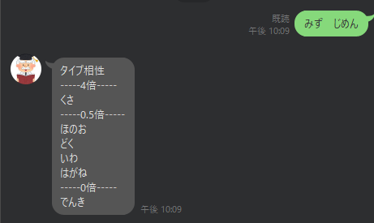
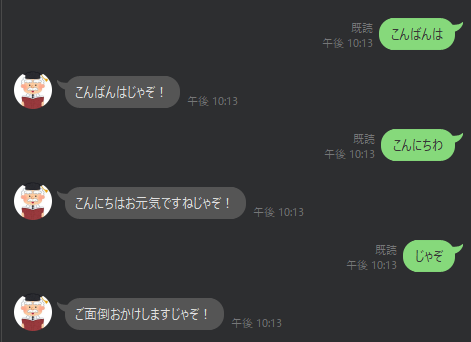

## はじめに
前回、ポケモンのステータスとポケモンの育成方法が記載されたリンクを送るオーキド博士botを作りました。
ただ、ポケモンの情報だけでなく、ポケモンのタイプ相性も知りたいと思います。
また、定型文だけだとつまらないので、apiを用いてテキトーに受け答えできるようにしたいと思います。
なので、下記の2点について以前作ったオーキド博士botをパワーアップさせたいと思います。
- ポケモンのタイプ相性を答える
- キーワード以外の言葉のテキストの場合に受け答えする
## タイプ相性の実装
### ポケモンのタイプ相性データの用意
今回使用したポケモンのタイプ相性のデータは[こちら](https://github.com/retrorocket/poke-weak)からタイプ相性のデータを頂きました。

https://github.com/fanzeyi/pokemon.json

こちらには、2倍、1/2倍、0倍の組み合わせになるタイプ相性がjson形式のデータとして格納されています。
上記では、タイプ相性のデータの他にLine Botのコードも格納されているので、是非確認してみてください。(今回はpythonで実装)

### タイプ相性の機能の実装
タイプ相性について、実装
- 入力タイプ相性の計算
- 入力タイプに対するタイプ相性の出力
### 事前準備
実行するpythonファイルと同じ階層に事前に取得したタイプ相性が記載された下記のjsonファイルを格納してください。
- double.json
- half.json
- zero.json

### 入力タイプ相性の計算
下記にタイプ相性を計算する関数を記載します。
```python:title=app.py
def cal_type_score(input_types):
    double_list_json = open('./double.json','r')
    half_list_json = open('./half.json','r')
    zero_list_json = open('./zero.json','r')

    double_list = json.load(double_list_json)
    half_list = json.load(half_list_json)
    zero_list = json.load(zero_list_json)

    keys = list(u_dict.values())
    values = [1 for i in range(len(keys))]
    types_score = dict(zip(keys, values))

    input_types = input_types.split()
    for type in input_types:
        for i in range(len(double_list['types'])):
            if (type in double_list['types'][i]):
                for double_types in double_list['types'][i].values():
                    for double_type in double_types:
                        types_score[double_type] *= 2
        for i in range(len(half_list['types'])):
            if (type in half_list['types'][i]):
                for half_types in half_list['types'][i].values():
                    for half_type in half_types:
                        types_score[half_type] *= 0.5
        for i in range(len(zero_list['types'])):
            if (type in zero_list['types'][i]):
                for zero_types in zero_list['types'][i].values():
                    for zero_type in zero_types:
                        types_score[zero_type] *= 0
    return types_score
```
タイプ相性を計算する関数`cal_type_score`の引数には、Lineで入力されたtextが入ります。
返り値には入力されたタイプに対する、各タイプの相性の値(0倍、0.5倍、2倍 .etc)がjson形式で出力されます。


### 入力タイプに対するタイプ相性の出力
下記にタイプ相性を出力する関数を記載します。
```python:title=app.py
def get_keys_from_value(d, val):
    return [k for k, v in d.items() if v == val]

def export_type_score(types_score):
    type_score_message ="タイプ相性"
    four_times_types = get_keys_from_value(types_score, 4)
    if len(four_times_types)!=0 :
        type_score_message += "\n-----4倍-----\n"
        type_score_message += '\n'.join(four_times_types)
    two_times_types = get_keys_from_value(types_score, 2)
    if len(two_times_types)!=0 :
        type_score_message += "\n-----2倍-----\n"
        type_score_message += '\n'.join(two_times_types)
    half_types = get_keys_from_value(types_score, 0.5)
    if len(half_types)!=0 :
        type_score_message += "\n-----0.5倍-----\n"
        type_score_message += '\n'.join(half_types)
    quarter_types = get_keys_from_value(types_score, 0.25)
    if len(quarter_types)!=0 :
        type_score_message += "\n-----0.25倍-----\n"
        type_score_message += '\n'.join(quarter_types)
    zero_types = get_keys_from_value(types_score, 0)
    if len(zero_types)!=0 :
        type_score_message += "\n-----0倍-----\n"
        type_score_message += '\n'.join(zero_types)
    return type_score_message
```
関数`cal_type_score`で得られた計算結果を使用して、0倍・0.25倍・0.5倍・2倍・4倍の場合のみ抽出し、出力します。
関数`get_keys_from_value`はjson形式でvalueからkey名を取得します。

## APIを用いた自動受け答え
### 事前準備
今回、[Talk API](https://a3rt.recruit.co.jp/product/talkAPI/)というRRECRUIT社が提供するAPIを使用して自動応答Botを作成しました。
実装にあたり、こちらの記事を参考にしました。
https://datacoach.me/data/tips/python-linebot-talk/#LINE_Bot


### 自動応答Bot実装
自動応答Botの実装部分は下記の通りです。
ほとんど参考にした記事のままです。（ありがとうございます。）
https://datacoach.me/data/tips/python-linebot-talk/#LINE_Bot


```python:title=app.py
data = {
    "apikey": os.environ["YOUR_TALK_API_KEY"],
    "query": event.message.text ,
}

data = urllib.parse.urlencode(data).encode("utf-8")
with urllib.request.urlopen("https://api.a3rt.recruit.co.jp/talk/v1/smalltalk", data=data) as res:
    #response = res.read().decode("utf-8")
    reply_json = json.loads(res.read().decode("unicode_escape"))

    if reply_json['status'] == 0:
        reply = reply_json['results'][0]['reply']
        line_bot_api.reply_message(
            event.reply_token,
            TextSendMessage(text=reply + "じゃぞ！"))
```

## Botイメージ
今回作成したオーキド博士Botです。

”みず”、”じめん”はくさ4倍！！

ポケモンの名前・タイプ以外のテキストの場合、自動で応答できています


## おわりに
拙いコードですが、下記にコード格納しているので内容が気になる方は中見てください。
https://github.com/kuuumaaaa/pokemon-ookido

今回Line Botの開発で、さらにオーキド博士賢くできました。
今後はほかのLine Botも作成したいと思います。
